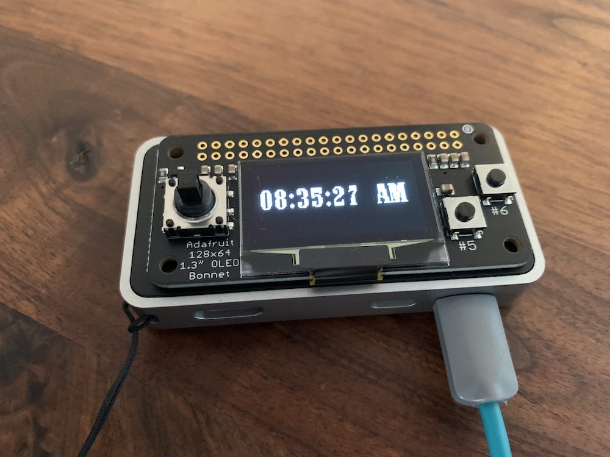
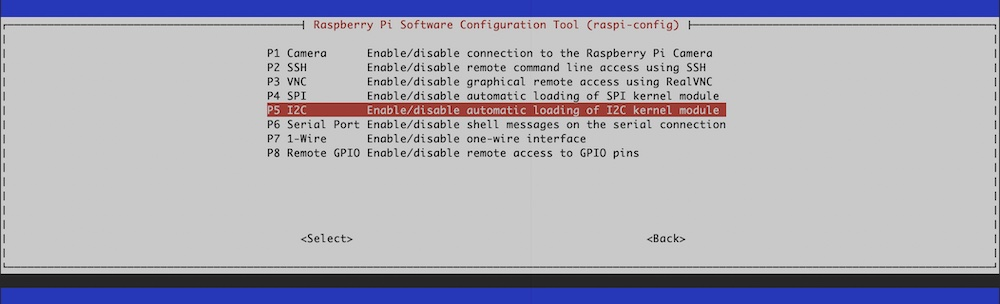

# Adafruit 128x64 OLED Bonnet for Raspberry Pi

The OLED Bonnet 128x64 (_monochrome_) from [Adafruit](https://www.adafruit.com/) is awesome! You can develop, with Circuitpython/Python, fast and easily applications and UI's. It offers completely new possibilities to bring the Raspberry Pi to a next level.

## Objective

The aim of this tutorial is to describe the installation of the OLED device.

_Attention: There is no need to solder the components beforehand!_



My OLED Bonnet on [Raspberry Pi Zero](https://www.raspberrypi.org/products/raspberry-pi-zero-w/) and [Flirc Case](https://flirc.tv/).

## Precondition

You should already have read (_and successful carried out_) the following tutorials.

- [Setup Raspberry PI](../Setup)
- [Prepare Raspberry PI](../Preparation)

## Install needed and/or optional packages

Install (_or ensure they are installed_) following packages.

```shell
# update system (optional)
$ sudo apt update -y && sudo apt upgrade -y

# install optional packages (optional)
$ sudo apt install -y vim

# install needed packages
$ sudo apt install -y python3-pip python3-pil
```

## OLED Bonnet (128x64 monochrome)

### Preparation

Enable the I2C interface on the Raspberry Pi.

```shell
# start console based raspi-config application
$ sudo raspi-config
```



Select `Interfacing Options`, next `I2C` and activate `<Yes>`.

### Install OLED Bonnet Python libraries

```shell
# install circuitpython library
$ sudo pip3 install adafruit-circuitpython-ssd1306

# install adafruit-python-shell
$ sudo pip3 install adafruit-python-shell

# download python-blinka
$ wget https://raw.githubusercontent.com/adafruit/Raspberry-Pi-Installer-Scripts/master/raspi-blinka.py

# install python-blinka
$ sudo python3 raspi-blinka.py

# reboot (recommended)
$ sudo reboot
```

### Verify installation

Verify I2C and SPI devices.

```shell
# verify for i2c device (optional)
$ ls /dev/i2c*
...
/dev/i2c-1

# verify for spi device (optional)
$ ls /dev/spi*
...
/dev/spidev0.0  /dev/spidev0.1
```

Verify Python-blinka installation. [Here](./blinka-test.py) you will find the content.

```shell
# create test file
$ touch blinka-test.py

# start editor
$ vim blinka-test.py

# change permissions
$ chmod +x blinka-test.py

# execute test file
$ ./blinka-test.py
```

### Verify OLED Bonnet

Shutdown the Raspberry Pi, plug in the OLED Bonnet device and start the Raspberry Pi again.

```shell
# scan the I2C bus for OLED bonnet
$ sudo i2cdetect -y 1
...
     0  1  2  3  4  5  6  7  8  9  a  b  c  d  e  f
00:          -- -- -- -- -- -- -- -- -- -- -- -- -- 
10: -- -- -- -- -- -- -- -- -- -- -- -- -- -- -- -- 
20: -- -- -- -- -- -- -- -- -- -- -- -- -- -- -- -- 
30: -- -- -- -- -- -- -- -- -- -- -- -- 3c -- -- -- 
40: -- -- -- -- -- -- -- -- -- -- -- -- -- -- -- -- 
50: -- -- -- -- -- -- -- -- -- -- -- -- -- -- -- -- 
60: -- -- -- -- -- -- -- -- -- -- -- -- -- -- -- -- 
70: -- -- -- -- -- -- -- -- 
```

### Start with development

Now you can start with the Python development. There are some [examples on GitHub](https://github.com/adafruit/Adafruit_CircuitPython_SSD1306/tree/master/examples), which are quite helpful. [Here](./bonnet-buttons.py) is the best script to start and understand.

```shell
# create file
$ touch bonnet-buttons.py

# start editor
$ vim bonnet-buttons.py

# change permissions
$ chmod +x bonnet-buttons.py

# execute file
$ ./bonnet-buttons.py
```

[Go Back](../readme.md)
