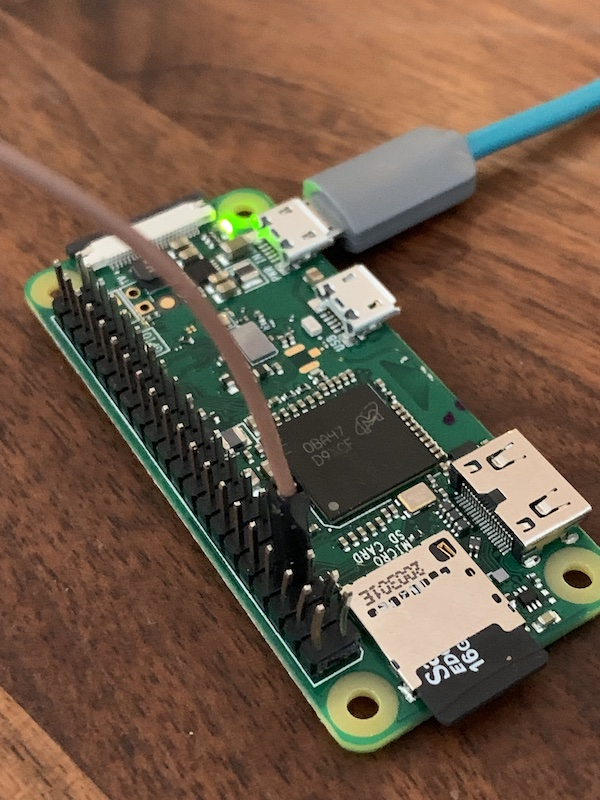
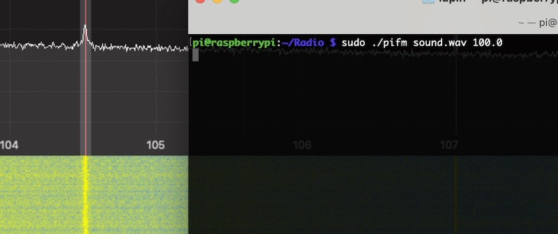

# Raspberry Pi Zero (W/WH) - FM Radio Transmitter

The Raspberry Pi (_actually mostly all models with GPIO header_) can act as an FM Radio transmitter very quickly and easily. All you need is a short cable (_approx. 10 cm is sufficient_) and some software.

## Objective

The aim of this tutorial is to use the Raspberry PI Zero as FM Radio transmitter.

## Precondition

You should already have read (_and successful carried out_) the following tutorials.

- [Setup Raspberry PI](../Setup)
- [Prepare Raspberry PI](../Preparation)

## Install needed and/or optional packages

Install (_or ensure they are installed_) following packages.

```shell
# update system (optional)
$ sudo apt update -y && sudo apt upgrade -y

# install optional packages (optional)
$ sudo apt install -y curl
```

## FM Radio Transmitter

Now connect the cable to GPIO 4 and start your Raspberry Pi Zero.



```shell
# create directory and change into it
$ mkdir Radio && cd Radio

# download needed application
$ curl http://omattos.com/pifm.tar.gz -o pifm.tar.gz

# unzip archive
$ tar -zxvf pifm.tar.gz

# show help (optional)
$ ./pifm

# start simple transmit
$ sudo ./pifm sound.wav 100.0

# start advanced transmit
$ sudo ./pifm left_right.wav 100.0 22050 stereo
```

_Note: The optimal length of the cable should be approx. 75 cm (As long as you have the necessary rights to operate)._



[Go Back](../readme.md)
