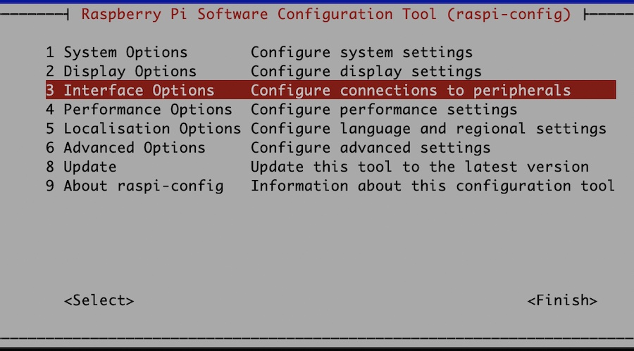
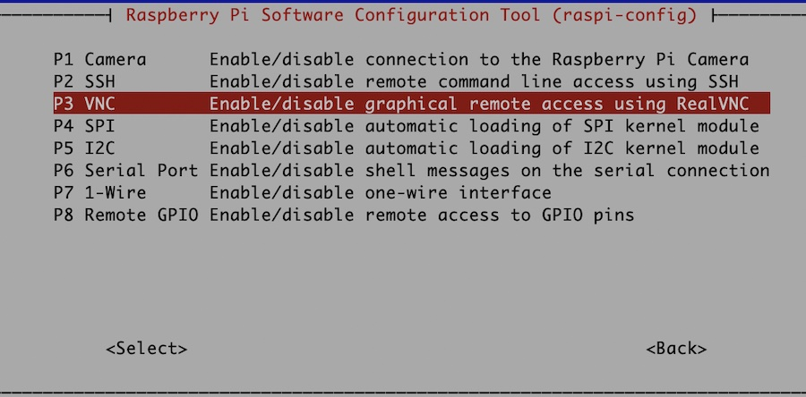
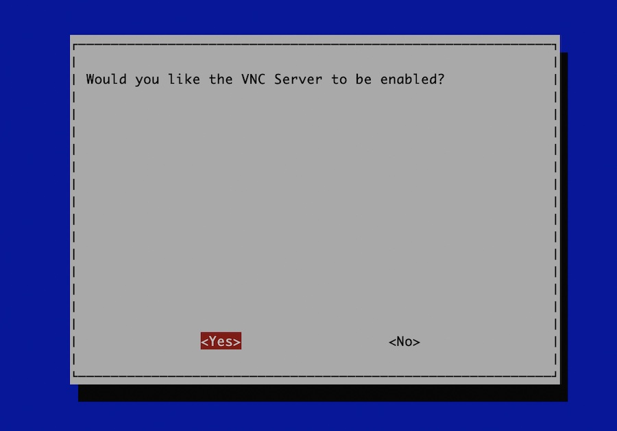
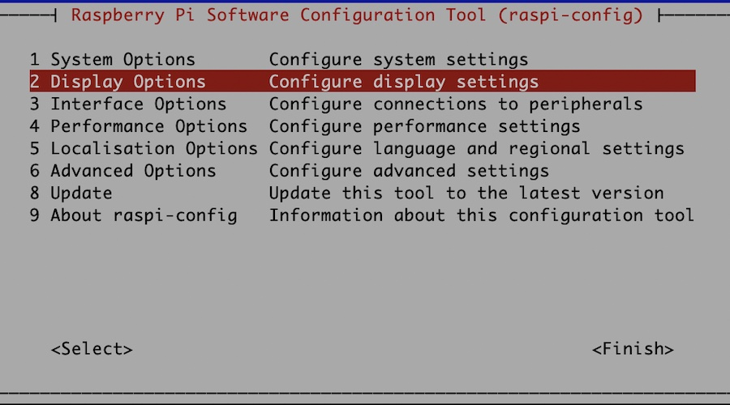
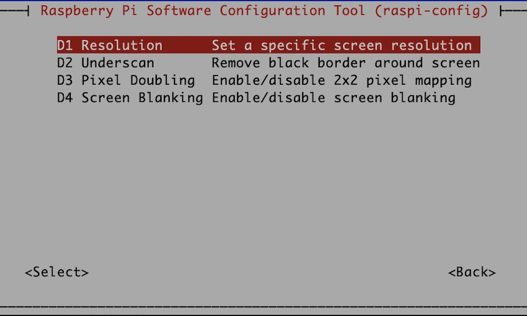
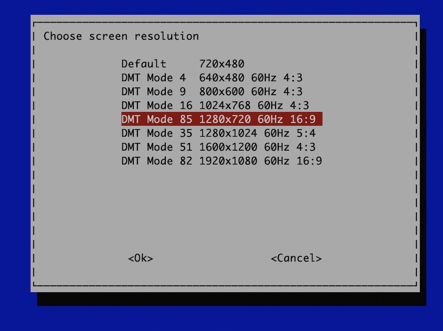

# Raspberry PI - macOS - VNC

If you need to work with the GUI of your Raspberry PI and you don't have a screen, mouse and keyboard for the Raspberry but for example a macOS, you don't need to install any extra software. Both systems deliver already anything you need.

## Objective

The aim of this tutorial is to establish a VNC connection from macOS to Raspberry PI only with default tools of both OS.

## VNC configuration

```shell
# start the raspi-config
$ sudo sudo raspi-config
```

Select Interface Options



Select VNC Options



Enable VNC



Select Display Options



Select Resolution Options



Select DMT Mode 85



If all options are set, reboot the Raspberry device.

```shell
# set password
sudo vncpasswd -service

# create and modify common.custom file
sudo vim /etc/vnc/config.d/common.custom

# restart vncserver-x11-serviced
sudo systemctl restart vncserver-x11-serviced
```

The content of file `/etc/vnc/config.d/common.custom`.

```
Authentication=VncAuth
```

## macOS

To start the VNC connection, simply press `command` and `space` keys. Type `screen Sharing` and hit `ENTER`. Insert the IP of your Raspberry PI and press button `Connect`. At the last step insert the password and continue.


