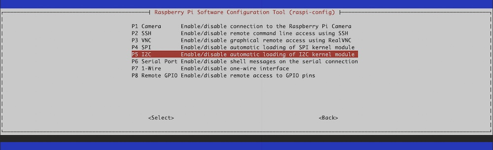

# Install Pimoroni Button SHIM on Raspberry PI

With Pimoroni [Button SHIM](https://shop.pimoroni.com/products/button-shim) device you can have fast and easily 5 physical buttons and one LED on your device. What you do with it is up to you, the possibilities are almost unlimited.

## Objective

The aim of this tutorial is to describe the configuration of Raspberry PI, the installation of the necessary software. Additional a tiny test whether everything is ready for further development.

_Attention: You have to solder the components beforehand, this is not described here!_

## Precondition

You should already have read (_and successful carried out_) the following tutorials.

- [Setup Raspberry PI](../Setup)
- [Prepare Raspberry PI](../Preparation)

## Install needed and/or optional packages

Install (_or ensure they are installed_) following packages.

```shell
# update system (optional)
$ sudo apt update -y && sudo apt upgrade -y
```

## Preparation

Enable the I2C interface on the Raspberry Pi.

```shell
# start console based raspi-config application
$ sudo raspi-config
```



Select `Interfacing Options`, next `I2C` and activate `<Yes>`.

## Install Python Button SHIM

```shell
# install button shim package
$ sudo apt install -y python3-buttonshim
```

## Test the device

```shell
# start python console
$ python3
```

Test the device LED.

```python
# import button shim library
>>> import buttonshim

# LED light up red
>>> buttonshim.set_pixel(0xff, 0x00, 0x00)

# LED light up green
>>> buttonshim.set_pixel(0x00, 0xff, 0x00)

# LED light up blue
>>> buttonshim.set_pixel(0x00, 0x00, 0xff)

# exit python console
>>> exit()
```

_Note: Read this [documentation](http://docs.pimoroni.com/buttonshim/) to get more information, or have a look on these [GitHub examples](https://github.com/pimoroni/button-shim/tree/master/examples) to start faster._

[Go Back](../readme.md)
