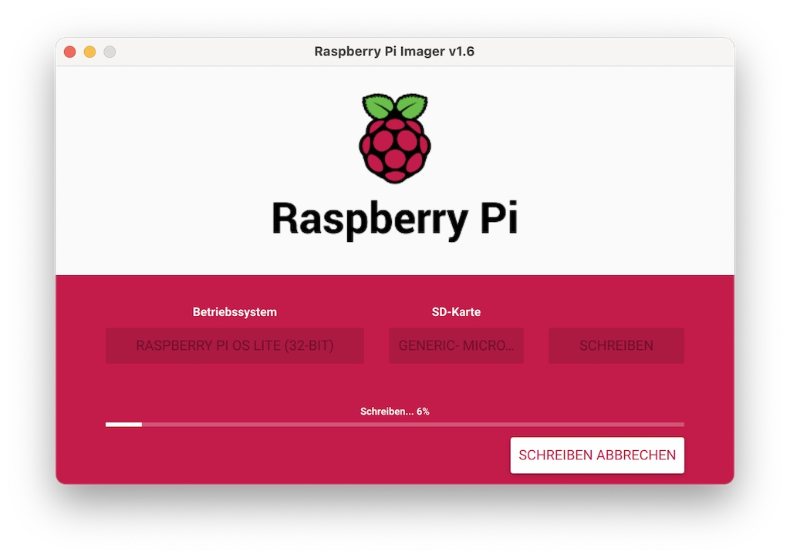
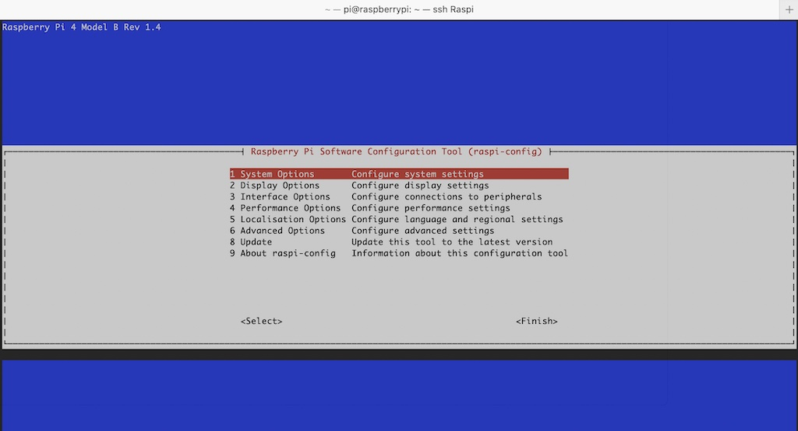

# Setup Raspberry PI (_headless_)

In order to be able to follow the tutorials better, I would like to quickly show you how to set up the Raspberry PI.

_Note: There are also many other setup options, the one shown here is just a suggestion!_

## Objective

The aim of this tutorial is to show the initial setup.

## Install Raspberry Pi

The easiest and most comfortable installation is with the `Raspberry Pi Imager`. You can download it [here](https://www.raspberrypi.org/software/) and then install it. As soon as the installation is successfully completed, put the SD card into your SD card into your SD card reader and run Raspberry Pi Imager. First, select the OS (_e.q. Raspberry Pi OS Lite_). Second, select the SD card and third press button `Write`. 



## Enable SSH

To enable SSH on headless Raspberry PI, simply create the (_empty_) file named `ssh`, into the boot partition of the SD card.

```shell
┌──[lupin@macOS]::[~]
└─ % touch /Volumes/boot/ssh
```

## Enable Wi-Fi

Similar to SSH you also can set up already the Wi-Fi (_as STA_). Only difference is that this configuration `wpa_supplicant.conf`_ file needs some content.

```shell
┌──[lupin@macOS]::[~]
└─ % vim /Volumes/boot/wpa_supplicant.conf
```

Add the content to your configuration file (_depending on your location and Wi-Fi_).

```
ctrl_interface=DIR=/var/run/wpa_supplicant GROUP=netdev
update_config=1
country=<Country code>

network={
 ssid="<Name of your Wi-Fi AP>"
 psk="<Password>"
}
```

Unmount the SD card, plug into Raspberry PI and start up the device. After the start, connect with SSH (_user: pi and password: raspberry_) and change to user `root`. As root run the command `raspi-config` and finish your setup.

```shell
┌──[lupin@macOS]::[~]
└─ % ssh pi@raspberry.local

# change to root
$ sudo su -

# start console based raspi-config application
$ raspi-config
```



_Note: I activate SSH and set up the Wi-Fi again (_just to ensure_)._

[Go Back](../readme.md)
